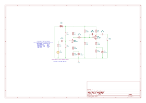
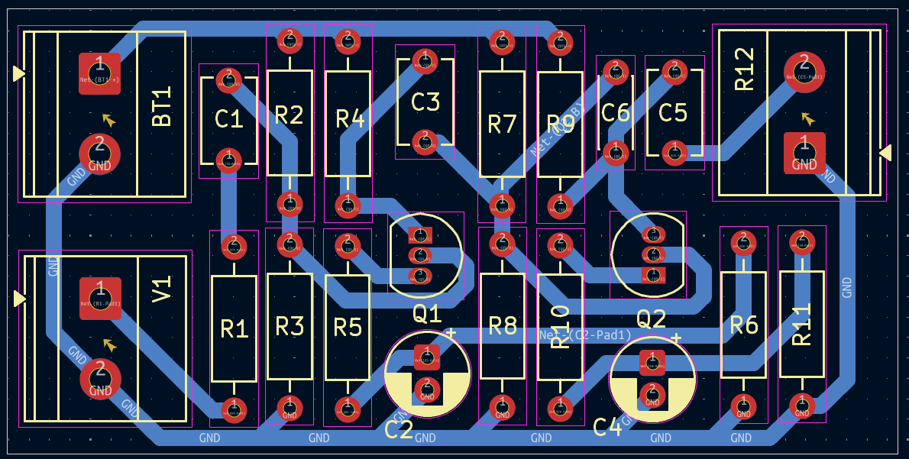

# Multi-Stage BJT Power Amplifier (v1.1)

A high-gain, dual-stage BJT amplifier project designed for the **Stage I (Feb 26)** milestone. This design is optimized for fabrication on a **presensitized PCB** with a compact footprint.

### Design Specifications
* **Target Gain ($A_v$):** $\ge 120$
* **Frequency Range (Ideal):** $80\text{Hz}$ to $20\text{kHz}$
* **Board Dimensions:** $2.18 \times 1.09$ inches
* **Trace Clearance:** $0.200\text{mm}$ ~ $0.400\text{mm}$ 
* **Track Width:** $0.8\text{mm}$ ~$1.0\text{mm}$
* **Fabrication Method:** Presensitized PCB

### Component Notes
* **Coupling Capacitors:** 10µF 50V **Monolithic Ceramics** (Code 106).
* **Bypass Capacitors:** 33µF **16V** Electrolytics.
* **Note:** Monolithic capacitors are utilized in this design as the primary representation for high-value ceramic components to ensure a compact and stable PCB layout.

### Components (Table of Expense)

| Category | Component Description | Qty | Unit Price (PHP) | Total (PHP) | Reference Link |
| :--- | :--- | :---: | :---: | :---: | :--- |
| **Active** | BC547 NPN Transistor (Unsorted) | 1 | ₱0.83 | ₱0.83 | [Shopee (100pcs)](https://shopee.ph/100pcs-BC547-TO-92-NPN-transistor-i.119376932.27625517704) |
| **Active** | 2N3904 NPN Transistor | 1 | ₱0.96 | ₱0.96 | [Shopee (50pcs)](https://shopee.ph/50PCS-2N3904-2N3906-2N4403-2N2907-2N4401-2N2222-PN2222-2N5401-2N5551-TO-92-TO92-Transistor-New-i.1130255612.20395632930) |
| **Capacitors** | 10µF 50V Monolithic Ceramic (106) | 3 | ₱0.98 | ₱2.94 | [Shopee (50pcs)](https://shopee.ph/product/497215439/24193377802) |
| **Capacitors** | 33µF 16V Electrolytic | 2 | ₱3.60 | ₱7.20 | [Shopee (5pcs)](https://shopee.ph/Electrolytic-Capacitor-16V-25V-35V-50V-i.535662606.26003134704) |
| **Resistors** | 1/4W Metal Film Resistors | 11 | ₱3.00 | ₱33.00 | Local Retail |
| **Connectors** | 2-Pin Screw Terminal (5.0mm) | 3 | ₱4.20 | ₱12.60 | [Shopee (10pcs)](https://shopee.ph/10Pcs-KF301-2P-Screw-5.0mm-Terminal-Block-i.487295469.12046517038) |
| **Fabrication**| **Presensitized PCB (4x6 inches)** | 1 | **₱205.00** | **₱205.00** | [Lazada (Alexan)](https://www.lazada.com.ph/products/with-developer-alexan-presensitized-pcb-4x6-i1380024544.html) |
| **TOTAL** | | | | **₱261.53** | |

*Note: Unit prices are derived from bulk pack listings (Shopee/Lazada) to reflect actual prototype cost.*

### Design Documentation

#### Schematic Diagram

### PCB Layout & 3D Preview
| 2D Copper Trace View | 3D Rendered View |
| :--- | :--- |
|  |  |

### Repository Structure
* **`/Plot`**: Contains exported manufacturing files (SVG/PNG).